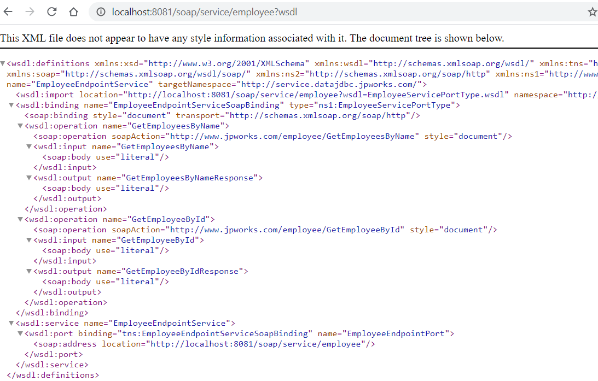
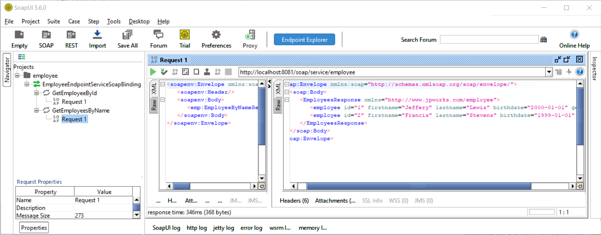

# Spring Boot Microservice - Apache Camel - CXF SOAP Service

A docker container created with Spring Boot exposing a SOAP endpoint for a legacy client using Apache Camel

## Starting Services Locally Without Docker

In order to run the project type in root folder:

```
mvn spring-boot:run
```

## Usage

To get the available endpoints, write in the browser:

```
http://localhost:8081/soap
```


To get the wsdl of the service, write in the browser:

```
http://localhost:8081/soap/service/employee?wsdl
```



We can test the application using an Http Client like PostMan or Jmeter using a POST call (the application uses for the test cases RestAssured library). 

In this case, we'll use SoapUI, the endpoint for the service is: `http://localhost:8081/soap/service/employee`




## WSDL and Domain Model

In our example, we are going to work in a fictitious Employee  SOAP service with 2 operations:

* GetEmployeeById
* GetEmployeeByName

For the demo, I separated the XSD from the WSDL. In a real scenario, this will be the most followed pattern but expect to have more than one XSD in different folders. The [employee.xsd](/src/main/resources/wsdl/employee.xsd) has the full domain model for the service, next diagram shows the main response sent back to the client


The WSDL is used for describing the functionality of the SOAP-based webservice. From all the sections in the WSDL file, the most important for us is the `wsdl:portType`. This section defines the interface for the service we want to implement: operations, input, and output parameters:


<a name="portType"></a>Next is the WSDL section for `wsdl:portType`:
```xml
<!--This element defines the service operations and the combination of input and output elements to clients-->
<wsdl:portType name="EmployeeServicePortType">
    <wsdl:operation name="GetEmployeeById">
        <wsdl:input message="tns:EmployeeByIdRequest"/>
        <wsdl:output message="tns:EmployeeResponse"/>
    </wsdl:operation>
    <wsdl:operation name="GetEmployeesByName">
        <wsdl:input message="tns:EmployeeByNameRequest"/>
        <wsdl:output message="tns:EmployeesResponse"/>
    </wsdl:operation>
</wsdl:portType>
```
The complete WSDL file is here: [EmployeeServices.wsdl](/src/main/resources/wsdl/EmployeeServices.wsdl)


## To Get Health Check

To show a summary of spring boot health check

```
curl -XGET -s http://localhost:8081/actuator/health
```

And you can see some info details as well

```
curl -XGET -s http://localhost:8081/actuator/info
```

See the `application.properties` to control what information to present in actuator.

## Camel Developer Console

This application includes `camel-console-starter` which is a basic developer console
that is accessible as a Spring Boot actuator endpoint via:

```
curl -XGET -s http://localhost:8081/actuator/camel
```

For example to get route information:

```
curl -XGET -s http://localhost:8081/actuator/camel/routes
```

## Camel CLI

This application is integrated with the Camel CLI via the `camel-cli-connector-starter` dependency (see `pom.xml`).
This allows to use the Camel CLI to manage this application, such as:

```
mvn spring-boot:run
```

And then use the CLI to see status:

```
camel get
PID   NAME                          CAMEL   PLATFORM            READY  STATUS   AGE  TOTAL  FAILED  INFLIGHT  SINCE-LAST
86000  sample.camel.MyCamelApplica…  3.19.0  Spring Boot v2.7.3   1/1   Running  11s      5       0         0          0s
```

## Contributing

For a complete guide to contributing to the project, see the [Contribution Guide](CONTRIBUTING.md).

We welcome contributions of any kind including documentation, organization, tutorials, blog posts, bug reports, issues, feature requests, feature implementations, pull requests, answering questions on the forum, helping to manage issues, etc.

The project community and maintainers are very active and helpful, and the project benefits greatly from this activity.

### Reporting Issues

If you believe you have found a defect in the project or its documentation, use the repository issue tracker to report the problem to the project maintainers.

If you're not sure if it's a bug or not, start by asking in the discussion forum. When reporting the issue, please provide the version.

### Submitting Patches

The project welcomes all contributors and contributions regardless of skill or experience level.

If you are interested in helping with the project, we will help you with your contribution.

We want to create the best possible tool for our development teams and the best contribution experience for our developers, we have a set of guidelines which ensure that all contributions are acceptable.

The guidelines are not intended as a filter or barrier to participation. If you are unfamiliar with the contribution process, the team will help you and teach you how to bring your contribution in accordance with the guidelines.

For a complete guide to contributing, see the [Contribution Guide](CONTRIBUTING.md).

## Code of Conduct

See the [code-of-conduct.md](./code-of-conduct.md) file

## License

See the [LICENSE](./LICENSE) file
